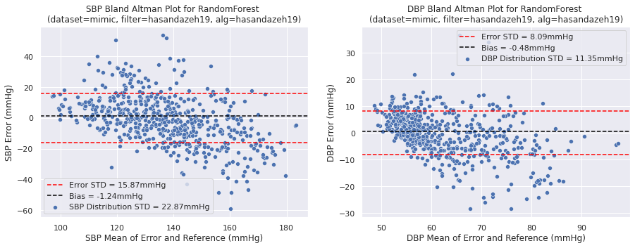

# Welcome to Wearable BP Benchmarks!

This repository provides supplementary code from our [review paper]() on Wearable BP for benchmarking BP estimation algorithms in an effort to provide a convenient machine learning pipeline for BP estimation, reduce heterogeneity in literature, and support community benchmarking on publicly available datasets.  Our review paper discusses Sensors and Systems, Pre-processing and Feature Extraction, and Algorithms. We adopt a metric called Explained Deviation (used here) to account for dataset heterogeneity and meta-analyze systems that show potential. Currently, this repository only contains examples of subject split as the calibration technique as there is no study that has sufficient power to detect the required effect size based on the AAMI/ANSI/ISO Standards. However, the workflow for personalization is the same. The only difference is that the initialized BP value is subtracted from all the BP values when creating the dataset (see below for pseudocode). Finally, check out our [website](https://wearablebp.github.io) for a Wearable BP paper search, meta-analysis, datasets, benchmarks, a list of third-party code, and a comparison between BP device standards.

============================

## File Structure
    ..
    ├── datasets                          # (need to create outside of cloned/forked repository) contains datasets
    ├── wearablebp_benchmarks             # repository to clone/fork
    │   └── models                        # contins best deep learning models
    │   └── results                       # contains results from both classical ML and deep learning algorithms
    │       └── features                  # contains features extracted from classical ML algorithms
    │       └── training                  # contains data from classical ML algorithm training in .pkl files
    │   └── runs                          # contains all saved model checkpoints from deep learning algorithms
    │   └── third_party                   # contains benchmarked code from various
    │   └── classical_ml                  # contains code for classical ML feature extraction
    │       └── train_feats.ipynb         # code for training classical ML algorithms on extracted features
    │   └── deep_learning                 # contains building blocks for training deep learning algorithms
    │       └── train_dl.ipynb            # code for training deep learning algorithms using PyTorch
    │       └── dl_dataloaders.py         # contains dataloaders written using `torch.utils.data.DataLoader`
    │       └── dl_models.py              # contains deep learning models from Jeong et al., (2021) and Huang et al., (2022)
    │       └── utils.py                  # contains misc utils for deep learning training
    │   └── tools
    │       └── ED_computations.ipynb     # code to reproduce explained deviation requirements from AAMI/ANSI/ISO standards
    │       └── datasets_to_h5.ipynb      # example code to convert datasets from their native filetype to .h5 
    │       └── make_plots.ipynb          # code to make Error vs Ground Truth, Correlation, and Bland-Altman plots
    │       └── viz.py                    # script to create Bland-Altman, Correlation, and Error-Reference plots

## How to use

#### Classical ML Workflow

1. Convert dataset into .h5 file. See `wearablebp_benchmarks/datasets_to_h5.ipynb`
2. Create folder in `wearablebp_benchmarks/classical_ml` with feature extractor name. Build and run feature extraction algorithm.
3. Save features in `wearablebp_benchmarks/results/features/`. Use naming conventions specified below.
4. Use `wearablebp_benchmarks/classical_ml/train_feats.ipynb` to train model using features extracted in 3. Model is saved in .pkl file using the same name in 3.
5. Use `wearablebp_benchmarks/make_plots.ipynb` to visualize data and compute Explained Deviation metrics

#### Deep Learning Workflow
1. Convert dataset into .h5 file. See `wearablebp_benchmarks/datasets_to_h5.ipynb`
2. Build dataloader in `wearablebp_benchmarks/deep_learning/dl_dataloaders.py`
3. Build model in `wearablebp_benchmarks/deep_learning/dl_models.py` with feature extractor name. Put relevant utils in `wearablebp_benchmarks/deep_learning/utils.py`
4. Use `wearablebp_benchmarks/deep_learning/train_dl.ipynb` to train model (specify options class variables). Model is saved in .pkl file using the same name in 3. Result and model files follow the naming conventions below.
5. Use `wearablebp_benchmarks/make_plots.ipynb` to visualize data and compute Explained Deviation metrics

#### Personalization workflow

1. Determine initialization method. Example: use the first BP measurement as initial value
2. Remove initialization data from dataset
3. Subtract initialization value from all other BP measurements
4. Convert dataset into .h5 file. See `wearablebp_benchmarks/datasets_to_h5.ipynb`
5. Do BP estimation using classical ML or deep learning workflow

Pseudocode for 1-3:
```
sbp0 = sbp[0]                     # use first SBP value as SBP initialization
dbp0 = dbp[0]                     # use first DBP value as DBP initialization
sbp_new = sbp[1:]                 # remove SBP initialization point
dbp_new = dbp[1:]                 # remove DBP initialization point
sbp_new = sbp_new - sbp0          # set new ground truth as change in SBP
dbp_new = dbp_new - dbp0          # set new ground truth as change in DBP
sensor_data = sensor_data[1:]     # remove sensor data used at initialization point
```

#### Results Naming Conventions

Result files are named in the form `<dataset name>_<filter name>_<algorithm name>`

```
dataset_name: original dataset used (i.e. MIMIC, PPG-BP, VitalDB)
filter_name: pre-processing algorithm name to create subset of dataset
algorithm_name: algorithm used for feature extraction (classical ML) or training (deep learning)
```

#### Results and Visualization

Results from classical ML and deep learning models are saved in the .pickle format `wearablebp_benchmarks/results/training/`, consisting of a dictionary with all the raw estimates, ground truths, errors, and distribution data. This results dictionary structure and the data visualization scripts in `wearablebp_benchmarks/make_plots.ipynb` support multiple machine learning models.

    dict{
            │   └── sbp                         # systolic blood pressure (SBP) sub-dict
            │       └── <sbp_model_name_1>      # model/estimator name used for SBP estimation (string)
            │           └── raw ests            # array of estimates from model for SBP
            │           └── raw gts             # array of ground truth values for SBP
            │           └── bias                # bias of model for SBP (scalar)
            │           └── err std             # standard deviation of error for SBP (scalar)
            │           └── dist std            # standard deviation of SBP distribution (scalar)
            │   └── dbp                         # systolic blood pressure (SBP) sub-dict
            │       └── <dbp_model_name_1>      # model/estimator name used for DBP estimation (string)
            │           └── raw ests            # array of estimates from model for DBP
            │           └── raw gts             # array of ground truth values for DBP
            │           └── bias                # bias of model for DBP (scalar)
            │           └── err std             # standard deviation of error for DBP (scalar)
            │           └── dist std            # standard deviation of DBP distribution (scalar)
                ...
            │       └── <sbp_model_name_n>
            │           └── sbp
            │               └── ...
            │           └── dbp
            │               └── ...
            │       └── <dbp_model_name_n>
            │           └── sbp
            │               └── ...
            │           └── dbp
            │               └── ...
            │   └── opt                         # options class (the configurations) used when building model
    }
    
The data visualization script supports different types of plots, including Error-Reference, Bland-Altman, and Correlation Plots. An example of a visual is shown below.



## Dependencies

```
h5py==2.10.0
numpy==1.19.2
pyampd==0.0.1
scipy==1.6.2
torch==1.7.1
```

A docker with all the dependencies can be found `mycheung/wearablebp:latest` or on dockerhub [here](https://hub.docker.com/repository/docker/mycheung/wearablebp/general). 